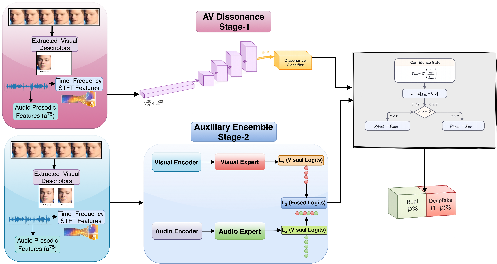

# DATS-AV: A Dissonance-Aware Two-Stage Framework for Audio–Visual Deepfake Detection

**Rubayet Kabir Tonmoy and Ajita Rattani**

Dept. of Computer Science and Engineering, University of North Texas, Denton, USA
`tonmoytonmoy@unt.edu` · `ajita.rattani@unt.edu`

---

> **Abstract.** Audio–visual deepfakes pose a growing threat to media authenticity by enabling realistic manipulation of speech, facial motion, or both modalities. Existing audio–visual (AV) deepfake detectors primarily follow two paradigms: heterogeneous feature fusion and agreement or dissonance modeling. Fusion-based methods rely on global cross-modal correlations and can fail under modality degradation or localized manipulation, while agreement-based methods degrade when alignment cues are weak or intentionally preserved. We propose **DATS-AV**, a two-stage AV deepfake detection framework that addresses these limitations by adaptively combining fine-grained audio–visual consistency reasoning with unimodal evidence. By decoupling agreement modeling from unimodal artifact detection, DATS-AV mitigates negative transfer and modality imbalance in multimodal deepfake detection. Across three benchmark datasets, DATS-AV consistently outperforms existing baselines under diverse evaluation settings, achieving a maximum absolute gain of **14.7%**.

**Keywords:** Audio–visual deepfake detection · Multimodal forensics · Cross-modal consistency · Two-stage detection · Robust generalization

---

## Overview



*Fig. 1. Overview of the proposed DATS-AV two-stage classifier framework.*

DATS-AV consists of two complementary stages:

1. **Stage 1 — AV Dissonance Classifier:** Estimates manipulation probability by explicitly modeling audio–visual agreement between temporally aligned speech acoustics and mouth-centric facial articulation. Uses fine-grained prosodic descriptors (75D) and mouth-motion statistics (20D) alongside STFT spectrograms to produce an interpretable dissonance score.

2. **Stage 2 — Auxiliary Unimodal Ensemble:** Handles cases where Stage 1's agreement signal is unreliable. Two independent experts (audio-only and visual-only) detect unimodal manipulation artifacts. A confidence-gating mechanism routes low-confidence samples from Stage 1 to Stage 2 for a final decision.

---

## Key Contributions

- **Fine-grained dissonance-oriented AV representation.** Temporally resolved prosodic statistics (energy, MFCCs, delta-MFCCs, log-mel band stats) paired with mouth-motion descriptors derived from optical flow, enabling sensitive detection of short-duration AV inconsistencies beyond globally pooled embeddings.

- **Sequential two-stage detection framework.** A confidence-gated classifier in which a primary dissonance-based AV detector is complemented by calibrated audio-only and visual-only experts for uncertain cases, improving robustness when dissonance cues are weak, noisy, or intentionally well-synchronized.

- **Comprehensive evaluation across datasets.** Evaluated on AV-DeepFake1M, FakeAVCeleb, and LAV-DF under both within-dataset and cross-dataset settings, demonstrating state-of-the-art performance and robust generalization across manipulation types.

---

## Results

### Intra-Dataset Performance (Table 1)

| Dataset | Method | Modality | AUC | ACC |
|---------|--------|----------|-----|-----|
| AV-DF1M | Meso4 | V | 0.502 | 0.750 |
| AV-DF1M | MesoInception4 | V | 0.500 | 0.750 |
| AV-DF1M | SBI | V | 0.658 | 0.690 |
| AV-DF1M | AVH-Align | AV | 0.859 | — |
| AV-DF1M | AVSFF | AV | — | 0.960 |
| AV-DF1M | **Ours: DATS-AV** | **AV** | **0.985** | **0.935** |
| FakeAVCeleb | MIS-AVoiDD | AV | 0.973 | 0.962 |
| FakeAVCeleb | PVAS-MDD | AV | 0.965 | 0.948 |
| FakeAVCeleb | FRADE | AV | 0.992 | 0.985 |
| FakeAVCeleb | **Ours: DATS-AV** | **AV** | **1.000** | **0.998** |
| LAV-DF | FAU-Forensics | AV | 0.999 | 0.997 |
| LAV-DF | DiMoDif | AV | 0.998 | — |
| LAV-DF | **Ours: DATS-AV** | **AV** | **0.992** | **0.943** |

### Cross-Manipulation Evaluation on FakeAVCeleb (Table 2, AUC)

| Method | Modality | RVRA | FVRA | RVFA | FVFA |
|--------|----------|------|------|------|------|
| Xception | V | — | 0.883 | — | 0.843 |
| LipForensics | V | — | 0.977 | — | 0.889 |
| AVFF | AV | — | 0.982 | 0.924 | 0.999 |
| FRADE | AV | — | 0.992 | 0.985 | 0.999 |
| **Ours: DATS-AV** | **AV** | **1.000** | **0.999** | **0.999** | **0.999** |

*FVRA = Fake Visual, Real Audio · RVFA = Real Visual, Fake Audio · FVFA = Fake Visual, Fake Audio · RVRA = Real Visual, Real Audio*

### Cross-Dataset Evaluation — Trained on AV-DF1M (Table 3)

| Method | AUC FakeAVCeleb (LAV-DF) | ACC FakeAVCeleb (LAV-DF) | EER FakeAVCeleb (LAV-DF) |
|--------|--------------------------|--------------------------|--------------------------|
| AVH-Align | **0.775** (—) | — (—) | — (—) |
| AVSFF | — (—) | **0.967** (0.950) | — (—) |
| **Ours: DATS-AV** | 0.758 (**0.979**) | 0.709 (0.914) | **0.293** (**0.081**) |

---

## Project Structure

```
DATS-AV/
├── model.py          # DissonanceDualModel — Stage 1 (DissonanceExpert) +
│                     #   Stage 2 (AuxEnsembleExpert: VisualOnlyModel + AudioOnlyModel)
│                     #   + DualCriterion multi-task loss
├── dataloader.py     # Unified AV dataloader for AV-DF1M, FakeAVCeleb, LAV-DF
├── train.py          # Training script (multi-task: AV dissonance + unimodal experts)
├── evaluate.py       # Evaluation / test script with two-stage inference routing
├── calibrate.py      # Temperature scaling calibration for confidence gating
├── assets/
│   └── framework.png # Architecture figure
├── requirements.txt
└── .gitignore
```

---

## Installation

1. **Clone the repository**
   ```bash
   git clone https://github.com/Tonmoy1321/DATS-AV.git
   cd DATS-AV
   ```

2. **Create a conda environment**
   ```bash
   conda create -n datsav python=3.10 -y
   conda activate datsav
   ```

3. **Install dependencies**
   ```bash
   pip install -r requirements.txt
   ```

4. **Download pretrained backbone**

   The visual encoder uses a ResNet-50 backbone pretrained on ImageNet (downloaded automatically via `torchvision` on first run). Face detection requires YOLOv8:
   ```bash
   # Download yolov8n-face.pt and place it in the project root
   # (required by dataloader.py for face crop extraction)
   ```

---

## Datasets

DATS-AV is evaluated on three public benchmarks:

| Dataset | Description | Link |
|---------|-------------|------|
| **AV-DeepFake1M** | Large-scale LLM-driven AV deepfake dataset | [arXiv:2311.15308](https://arxiv.org/abs/2311.15308) |
| **FakeAVCeleb** | Audio-visual celebrity deepfake dataset | [Paper](https://openreview.net/forum?id=DiQbxAOm0gP) |
| **LAV-DF** | Content-driven AV deepfake with temporal forgery labels | [IEEE DICTA 2022](https://ieeexplore.ieee.org/document/10004980) |

Set the dataset paths in `train.py` and `evaluate.py` under the `CONFIG` dictionary.

---

## Usage

### Training

```bash
python train.py
```

Configure dataset paths, hyperparameters, and training options in the `CONFIG` dictionary at the top of `train.py`.

### Evaluation

```bash
python evaluate.py
```

Runs two-stage inference (Stage 1 → confidence gate → Stage 2) and reports AUC, ACC, EER, and AP per dataset.

### Calibration

```bash
python calibrate.py
```

Fits temperature scaling on a held-out validation set to calibrate the Stage 1 confidence gate threshold τ.

---

## Method Details

### Audio–Visual Feature Representation

**Audio features (two complementary representations):**
- **STFT magnitude spectrogram** S ∈ ℝ^(T_a × F_a): captures local time–frequency structure via a convolutional encoder with temporal pooling.
- **Prosodic descriptor** a^75 ∈ ℝ^75: segment-level statistics comprising energy dynamics (6D), MFCC-based spectral summaries (36D), delta-MFCC variability (12D), delta-delta-MFCC variability (12D), and log-mel band energy statistics (9D).

**Visual features (two complementary representations):**
- **Face crop sequence** F ∈ ℝ^(T_v × 3 × H × W): ResNet-50 backbone on the mid-frame for appearance-based cues.
- **Mouth-motion descriptor** v^20 ∈ ℝ^20 (Stage 1) / v^75 ∈ ℝ^75 (Stage 2): derived from 2D optical flow magnitudes over the mouth ROI, summarized as segment-level statistical functionals.

### Stage 1: AV Dissonance Classifier

Given audio embedding z_a and visual embedding z_v, a joint fused embedding z_fuse = φ([z_a; z_v]) is computed. The dissonance classifier maps the triplet (z_a, z_v, z_fuse) to a scalar logit ℓ_av. A calibrated confidence score c = 2|p_av − 0.5| ∈ [0, 1] is derived, where p_av = σ(ℓ_av / T_av) and T_av is a temperature scaling parameter.

### Stage 2: Auxiliary Unimodal Ensemble

When Stage 1 confidence c < τ, the sample is routed to Stage 2. A learned gating network combines audio-only logit ℓ_a and visual-only logit ℓ_v:

ℓ_aux = α ℓ_a + (1 − α) ℓ_v

where α is output by a 6-dimensional reliability feature vector g = [p_diss, c_diss, F̄_a, E_a, E_v, σ_a] via a two-layer MLP.

### Training Objective

Multi-task loss jointly supervising both stages:

**L = L_mm + λ_aux · L_aux**

- **L_mm** = BCE(σ(ℓ_av), y_mm) — multimodal dissonance loss
- **L_aux** = BCE(σ(ℓ_a), y_a) + BCE(σ(ℓ_v), y_v) — auxiliary unimodal losses

---

## Citation

If you find this work useful, please cite:

```bibtex
@inproceedings{tonmoy2025datsav,
  author       = {Tonmoy, Rubayet Kabir and Rattani, Ajita},
  title        = {{DATS-AV}: A Dissonance-Aware Two-Stage Framework for Audio--Visual Deepfake Detection},
  booktitle    = {Proceedings of the International Conference on Pattern Recognition (ICPR)},
  year         = {2026},
  address      = {Lyon, France},
  organization = {International Association for Pattern Recognition (IAPR)}
}
```

---

## Acknowledgment

This work is supported by the Biometric and Social Media Research Laboratory ([VCBSL](https://ranger.unt.edu/rattani/)), Department of Computer Science and Engineering, University of North Texas.
